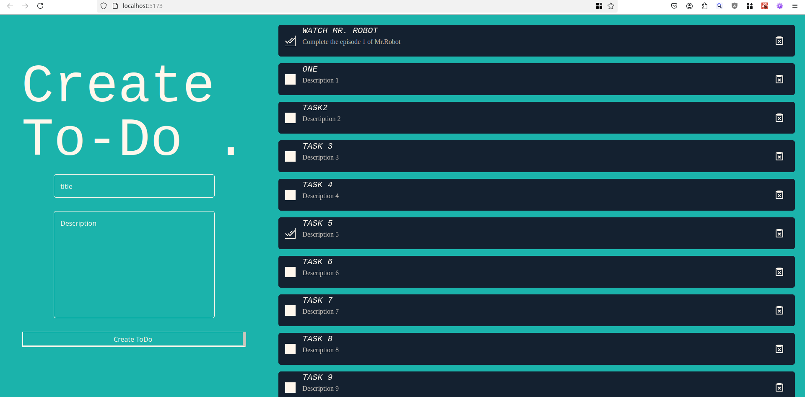

# learning-backend
This repository is for tracking my learning journey of backend development. Unfortunately, as the name suggests, it's backend, so there will be no pictures, as there is nothing to show other than code. So just go to files and see the code, instead of pictures of code, I am not putting those.

---
## Projects :
- [http-server-1](#http-server-1)
- [FileServer](#fileserver)
- [ToDoServer](#todoserver)
- [mongooseStarter](#mongoosestarter)
- [jwtServer](#jwtserver)
- [Todo App](#todoapp)

---
### [http-server-1](https://github.com/Sandstorm831/learning-backend/tree/main/http-server-1)
This is a very basic and very first implementation of a http server by me. Express library is used to build it. In it, the index.js file just basically return the sum of numbers over the server, while, in the kidney.js file, I have tried to use all the *POST*, *GET*, *PUT* and *DELETE* methods, trying to alter various properties. I think it's a good start, and it was fun too.

---
### [FileServer](https://github.com/Sandstorm831/learning-backend/tree/main/fileServer)
This is file Server, given a folder name, it can read and list all the files present in that folder, not iteratively, it can only read the files within that folder only. and given a file name, it can read the contents of that particular file. It's a handy server that let's me understand dynamic routing and also the *404* routing. I learned how middlewares are used in thse.

---
### [ToDoServer](https://github.com/Sandstorm831/learning-backend/tree/main/ToDoServer)
So, this server works a more realistically, still far from reality, but a good step towards it. In this I basically works on a **In Memory** object of todos, where each todos is a object in a array having a UID (Unique IDentifier) generated by random number generator and doing some operations on top of it to make it look super-random, apart from that, we have contents object in it, which include title string, description string and completed boolean. I try to do all kind of changes in it using the server, it was a good exercise to learn the basics, and a step closer to working with databases. All the changes will be disappeared after reload, but lemons in life are not so bad, when you have some water to make lemonade :P. 

---
### [MongooseStarter](https://github.com/Sandstorm831/learning-backend/tree/main/mongooseStarter)
So, this server is not a truly server learning exercise, but database querying learning exercise. I worked with a MongoDB server, learnt a few querying basics along side Mongoose as a MongoDB object modelling library for nodeJs. I tried writting in the database, updating, reading and also learned cross-referencing and populating. Cross referencing was new and challenging to learn at start. Created a middleware for *404* error. 

---
### [JWT Server](https://github.com/Sandstorm831/learning-backend/tree/main/jwtServer)
JWT Authorization, took some time to wrap my head around it, about why the hell is it needed, why can't user id and passwords are exchanged, what it does, saves 1 db call for every different routing, the safety it ensures and puts the Server in the ultimate control are some of the cool things I came to learn after studying and implementing JSON Web Tokens. So basically implemented two routes, one for signing-in , leading to jwt.sign() and one for any normal get route, testing the jwt.verify().

---
### [ToDo App](https://github.com/Sandstorm831/learning-backend/tree/main/toDoApp)
I know what you will say, In the name of backend-learning you have 2 todo apps on this repo out of 6, how does it make sense ? Well, it does, as it is a complete todo-application along with front-end (*So we'll also be having images*). In this, anyone can create a To-Do, Mark the to-do Done, Delete the Todo. Have used express as backend server, MongoDB as the database, Mongoose as the schema enforcer, React as frontend TailWindCSS for designing. So yes, it can be called as a full-stack project, a very-very basic full-stack project.

